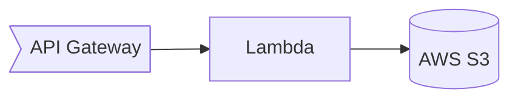

# Common Crawl Web Graph in AWS for $3 per month

try it - https://api.cc.dharnitski.com/domain/badssl.com

## Why

Common Crawl regularly releases host- and domain-level graphs, for visualising the crawl data.

To use that data you can use [Java SDK](https://github.com/commoncrawl/cc-webgraph) that suggetsst that 

>the webgraphs are usually multiple Gigabytes in size and require for processing a sufficient Java heap size (Java option -Xmx)

Depending on application, keeping all the data in memory may be not cost efficient.

Web Graph is static and sorted data. We can get single digit second latency by just reading that data from cold storage like S3.

## What

With this project you can:

1. Prepare data for querying
2. Build CLI application to access data from local folder
3. Build AWS API solution to access data stored in S3

